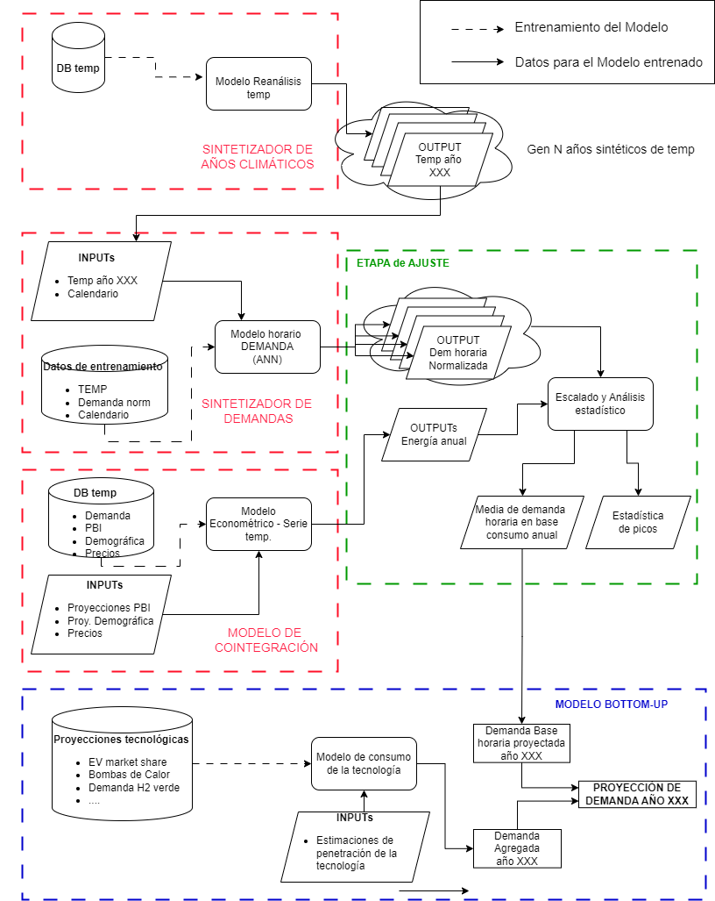
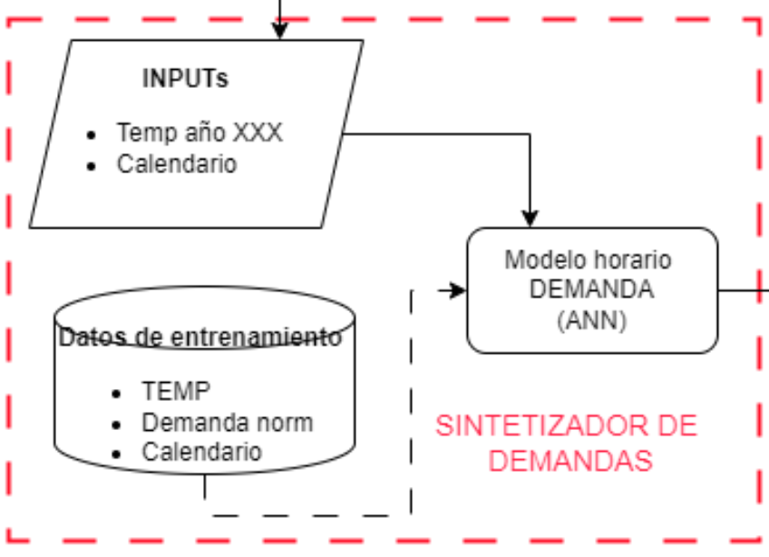
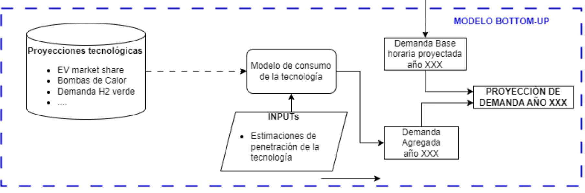

# UTE_E2

Este repositorio contiene código de ejemplo, archivos de datos y los primeros pasos para elaborar un modelo (y posterior aplicación) que sirva para generar escenarios futuros necesarios para el análisis de la demanda eléctrica en Uruguay en el largo plazo. El modelo se construye a partir de datos de consumo provistos por UTE y datos de carácter públicos provistos por diferentes instituciones. El código está escrito en Python y está destinado a ser ejecutado en Linux, Windows o Mac.




Existe una carpeta ['UTE_PRESENTACION/datos'](../datos) con archivos de datos par acorrer los notebooks y los scripts en forma local.

## Instalación y uso

Clonar el repositorio:

```console
!git clone https://github.com/smontes-fing/UTE_PRESENTACION.git
```

'''console
# Instalacion de dependencias
!pip install icecream
!pip install pandas==2.2.2
!pip install tensorflow==2.12
!pip install pillow matplotlib
!pip install netCDF4
!pip install gdown
'''


## Notebooks 
- [predecir_demanda.ipynb](https://colab.research.google.com/drive/1Dv_krXmmoliADKn0dZpeN01_aZRF1jv_?authuser=1#scrollTo=PdaFGqh-dhTG) 
Este Notebook sirve para levantar un archivos de escenarios de temperatura y generar predicciones.


- [generar_estadisticas.ipynb](https://colab.research.google.com/drive/1ykFmRU2u9V0cXB4ueDQmvvchR7nYdDUR?authuser=1#scrollTo=O1PRXnYkrm6b)
Este Notebook sirve para levantar un archivo de escenarios de predicciones de demanda, agregar un Driver y generar un análisis estadístico de resultados. 



##Archivos relevantes

- ['../datos'](../datos) Archivos de datos para levantar por los scripts
- ['../funciones'](../funciones) funciones y módulos auxiliares
- ['../modelos'](../modelos) Modelos precargados y sus escalers. También hay información del entrenamiento del modelo y sus hiperparámetros 
- ['../Imagenes_pipeline'](../Imagenes_pipeline) Algunas imagenes de referencia del pipeline y del modelo Analítico.
- ['../output'](../ouput) Directorio de salida de las imágenes de los scripts y notebooks.
- ['../salida'](../salida) Directorio de salida de los archivos de predicciones.
